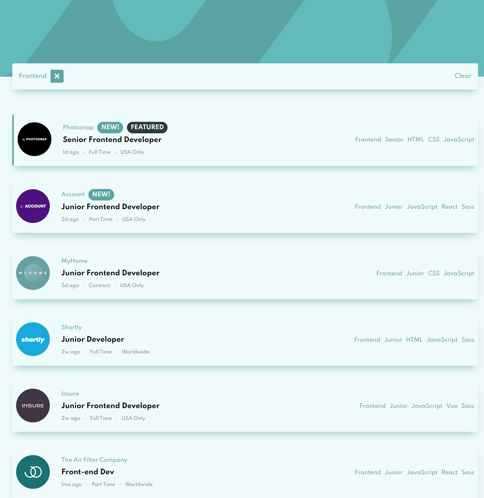

# Frontend Mentor - Static Job Listings

# Overview

A react application that uses a json data file to display all job postings. The application allows the user to filter jobs based on specfic job criteria(s)

## The challenge

Users should be able to:

-   View the optimal layout for the site depending on their device's screen size
-   See hover states for all interactive elements on the page
-   Filter job listings based on the categories

## Installation

You can clone the repo to your local machine and run `npm start` to get the application running.

## Stack

-   React js
-   Sass
